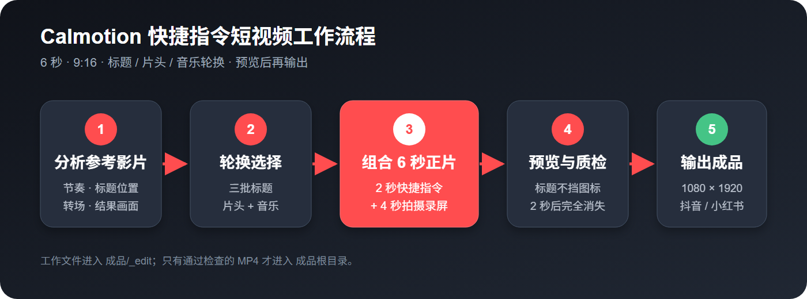
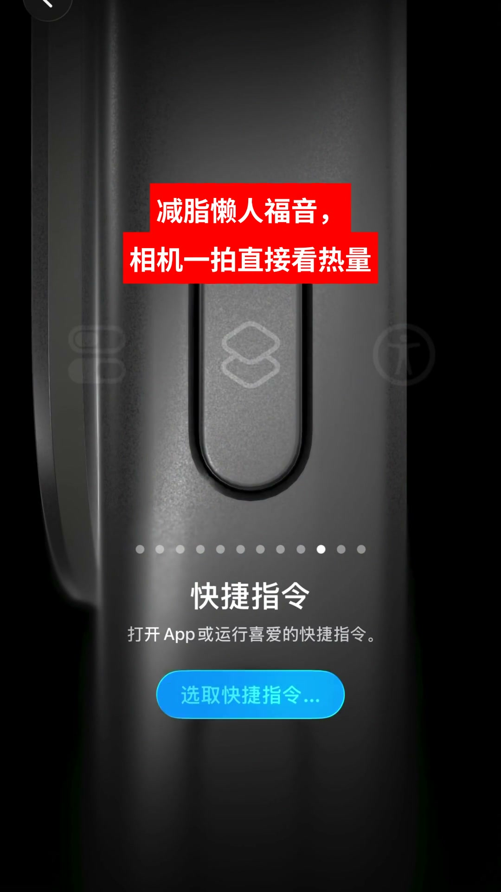
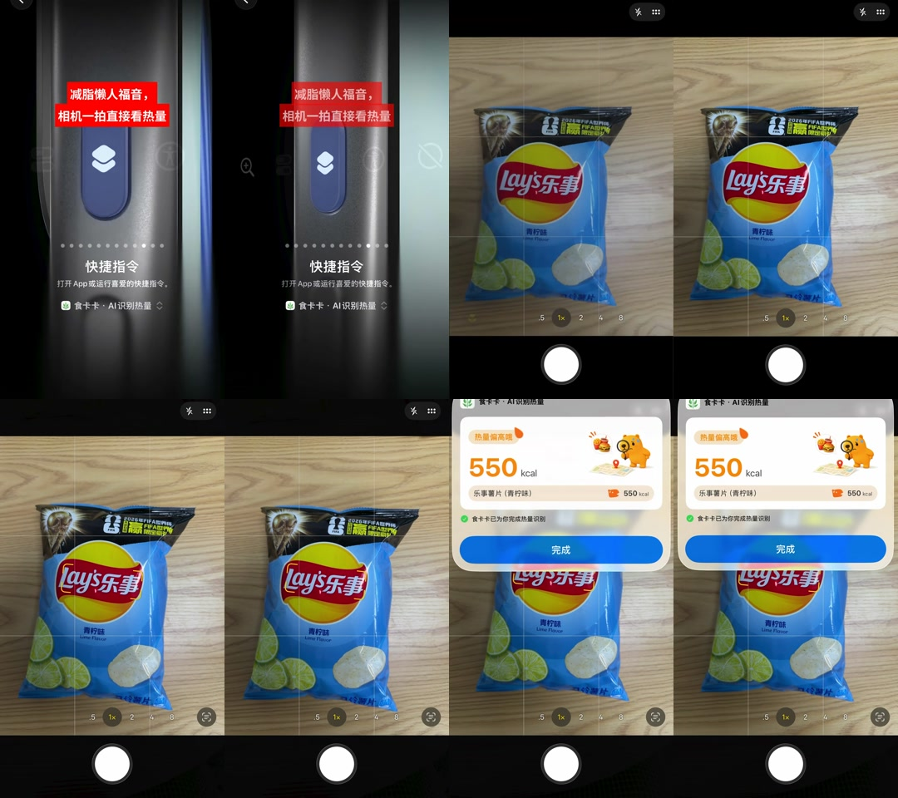

# 食卡卡 快捷指令短视频工作流 Skill

一个面向抖音 / 小红书的 Codex Skill：根据参考影片，把苹果快捷指令片头、食品拍摄录屏、三批轮换标题和轮换音乐组合成 6 秒中文竖屏成片。



## 已跑通的工作流程

1. 分析 `参考影片`，确认节奏、标题位置、转场方式和识别结果的展示方式。
2. 从 `标题\第一批.txt`、`第二批.txt`、`第三批.txt` 中按批次轮换选择标题。
3. 从 `素材\快捷指令素材` 轮换选择一个片头，与 `素材\拍摄录屏` 中的一条录屏组合：前 2 秒为快捷指令，后 4 秒为拍摄与识别结果。
4. 从 `音乐` 目录轮换选择一首音乐。
5. 先预览并检查，再把正式 MP4 直接输出到 `成品`。

核心画面约束：标题放在上方安全区，不能挡住快捷指令核心图标；标题必须在 2 秒片头结束时完全消失。

## 实际效果

标题使用白色中文粗体与红色底块，避开快捷指令按钮、主图标和系统 UI：

<p align="center">
  
</p>

转场检查会同时覆盖片头结束、拍摄画面和热量识别结果：



## 目录结构

```text
D:\视频素材\快捷指令\
├─ 参考影片\
├─ 标题\
│  ├─ 第一批.txt
│  ├─ 第二批.txt
│  └─ 第三批.txt
├─ 素材\
│  ├─ 快捷指令素材\
│  └─ 拍摄录屏\
├─ 音乐\
└─ 成品\
```

每次增加新的快捷指令片头、录屏或音乐，只需放入对应目录。Skill 会先盘点实际文件，再决定轮换顺序，不依赖固定文件名。

## 安装

将本仓库复制或克隆到 Codex Skills 目录：

```text
%USERPROFILE%\.codex\skills\calmotion-short-video-workflow
```

仓库根目录必须保留 `SKILL.md`。重新打开 Codex 后即可通过自然语言自动触发，也可以明确使用 `$calmotion-short-video-workflow`。

## 运行要求

- Windows PowerShell 5.1 或 PowerShell 7；
- `ffmpeg` 与 `ffprobe` 已加入 PATH；
- 一款可商用中文无衬线粗体。当前流程推荐思源黑体，可从用户指定的 [free-fonts 字体清单](https://github.com/dengcao/free-fonts/blob/main/README.md) 选择并在使用前核对对应许可证。

字体、音乐和原始视频不随 Skill 分发，继续从本地素材目录读取。

## 使用示例

```text
使用 $calmotion-short-video-workflow，处理 D:\视频素材\快捷指令 下新增的拍摄录屏。
按标题、快捷指令片头和音乐的轮换记录制作 6 秒成片，检查通过后输出到成品目录。
```

## 轮换逻辑

- 标题批次：第一批 → 第二批 → 第三批 → 循环。
- 标题内容：优先选择与当前食品/减脂场景匹配且没有使用过的标题。
- 快捷指令片头：按稳定文件顺序轮换，有多个素材时不连续重复。
- 音乐：按稳定文件顺序轮换，有多首音乐时不连续重复。
- 轮换状态：保存在 `成品\_edit\rotation-state.json`，成功完成一条成片后再更新。

## 成片标准

- 9:16，建议 1080x1920、60 fps。
- 总长 6.00 秒：2 秒快捷指令片头 + 4 秒拍摄录屏。
- 拍摄录屏段必须同时包含使用场景和热量识别结果。
- 中文标题两行以内，使用可商用中文无衬线粗体。
- 标题最晚在 2.00 秒完全消失，不能残留到拍摄录屏段。
- 正式输出为 H.264 + AAC MP4，兼容抖音和小红书。
- 不生成剪映草稿；中间文件统一放入 `成品\_edit`。

## 安全检查与验证

只读盘点素材与环境：

```powershell
powershell -ExecutionPolicy Bypass -File .\scripts\inventory.ps1
```

成片完成后检查所有 MP4 的时长、分辨率、帧率、编解码和完整解码：

```powershell
powershell -ExecutionPolicy Bypass -File .\scripts\validate_outputs.ps1
```

两个脚本都支持通过 `-ProjectRoot` 指定其他项目目录。

## 仓库内容

```text
.
├─ SKILL.md                    # Skill 入口与硬性约束
├─ README.md                   # 使用说明与效果展示
├─ references\workflow.md     # 完整剪辑、轮换和 QA 规范
├─ scripts\inventory.ps1      # 素材与环境盘点
├─ scripts\validate_outputs.ps1
└─ assets\                    # README 配图
```

本仓库不包含原始视频、音乐或字体文件；这些内容继续保存在本地项目素材目录中。
